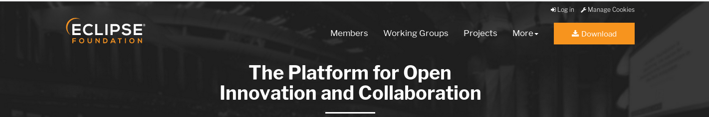
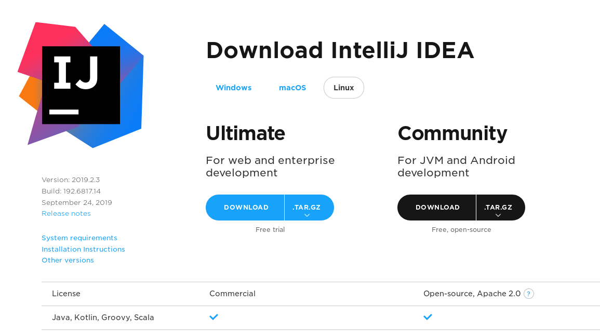

class: middle, center

# Hello World

Programmierpraktikum Java I im WiSe 2019/20

---

class: middle, center

# Who dat boi, who him is?

## Kai Niebes

## Langzeitstudent aus Leidenschaft

## Hilfskraft im IDH

---

class: middle, center


---

class: middle, center


# Organisatorisches

Fixplätze

Anwesenheitspflicht

Andere Gruppen


---

class: middle, center

# Was passiert in diesem Kurs

(Nach-)Besprechung der Inhalte der Vorlesung

Denkanstöße zum lösen der Hausaufgaben, oder

---

class: middle, center

# Sitzung #01 - 10.10.19

(Falls noch nicht passiert): AdoptOpenJDK8 & Eclipse

Java Boilerplate

Coding Conventions

Objektorientierte Programmierung

Klassen, wie & warum?

Eclipse (warum?)

---

class: middle, center

# AdoptOpenJDK

## https://adoptopenjdk.net/

Version: OpenJDK 8 (LTS)

JVM: Hotspot oder OpenJ9

---

class: middle, center

# Warum kein neueres Java?

---

class: middle, center

# Eclipse

## https://www.eclipse.org/



---

# Java Boilerplate

```java

public class HelloWorld {

    public static void main(String[] args) {
        // Code
    }

}
```

---

class: center, middle

# [Coding Conventions](caseconventions.jpeg)

---

class: center, middle

# Objektorientierte Programmierung (OOP)

## Warum?

---

class: center, middle

# Objektorientierte Programmierung (OOP)

# Struktur!

- Abstraktion (z.B. durch Klassen)
- Datenkapselung (durch Einteilungen wie private, protected, public)
- Polymorphie (Variablen mit mehreren/überschneidenden Datentypen)
- Persistenz (Variablen existierne mit ihren Objekten)
- Vererbung (Klassen können aufeinander aufbauen)

---

class: center, middle

# Klassen

## Warum?

---

class: center, middle

# Klassen

## Weil wir nicht alles in primitiven Datentypen ausdrücken wollen

---

# Primitive Datentypen

```java

// Ganzzahlen
byte
short
int
long

// Gleitkommazahlen
float
double

// Andere
boolean
void
char

```

---

class: center, middle

# Klassen

## Wo ist String?

String ist kein primitiver Datentyp

String ist (in simpler Form) eine Anreihung von chars

---

class: center, middle

# Klassen

## Programmierbeispiel

---

class: center, middle

# Eclipse

Eclipse ist eine quelloffene Entwicklungsumgebung mit Unterstützung für mehrere Programmiersprachen

Wird typischerweise für Java verwendet

Ist gewöhnungsbedürftig

---

class: center, middle

# Alternativen zu Eclipse



---

class: center, middle

# Warum vielleicht trotzdem Eclipse

## Die Hausaufgaben und die Semesterarbeit müssen in Eclipse importiert werden können und ausführbar sein

---

class: center, middle

# Danke für eure Aufmerksamkeit

# Bierle?

---
